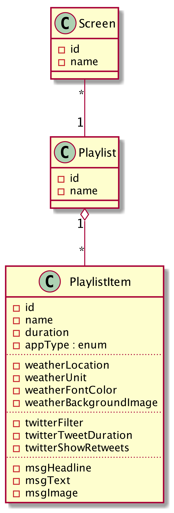

# Screenapp

SCC 2016 Project

## Overview

* Software Stack
* Installation
* Model

## Software Stack

* [sails.js](http://sailsjs.org)
    * ORM [Waterline](https://github.com/balderdashy/waterline-docs)
    * Adapters (MySQL, [NeDB](https://github.com/louischatriot/nedb)?)
* [reveal.js](http://lab.hakim.se/reveal-js/#/)

## Model

## Webclient (Anzeige)

* [reveal.js](http://lab.hakim.se/reveal-js/#/)
* iOS App 

