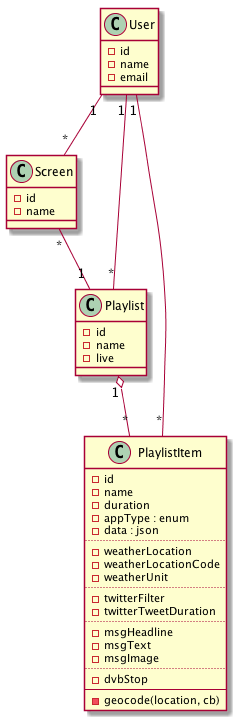
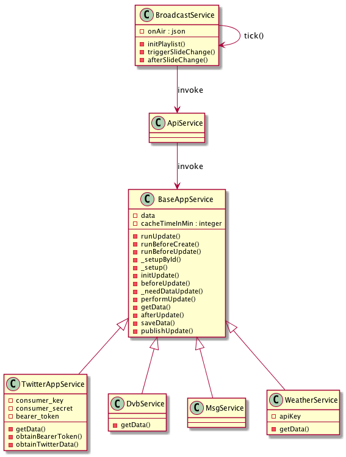
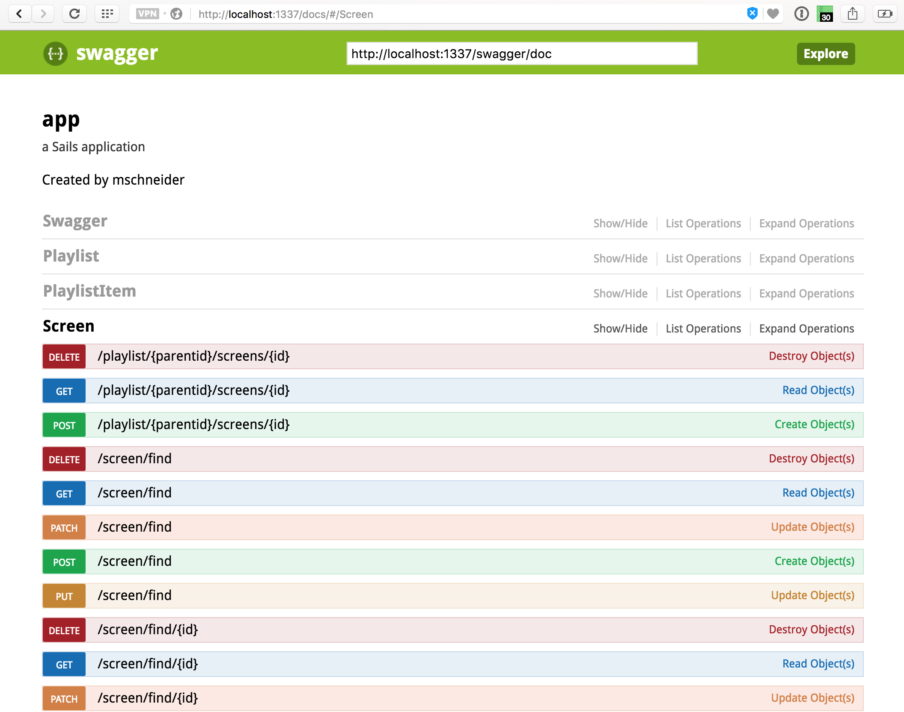
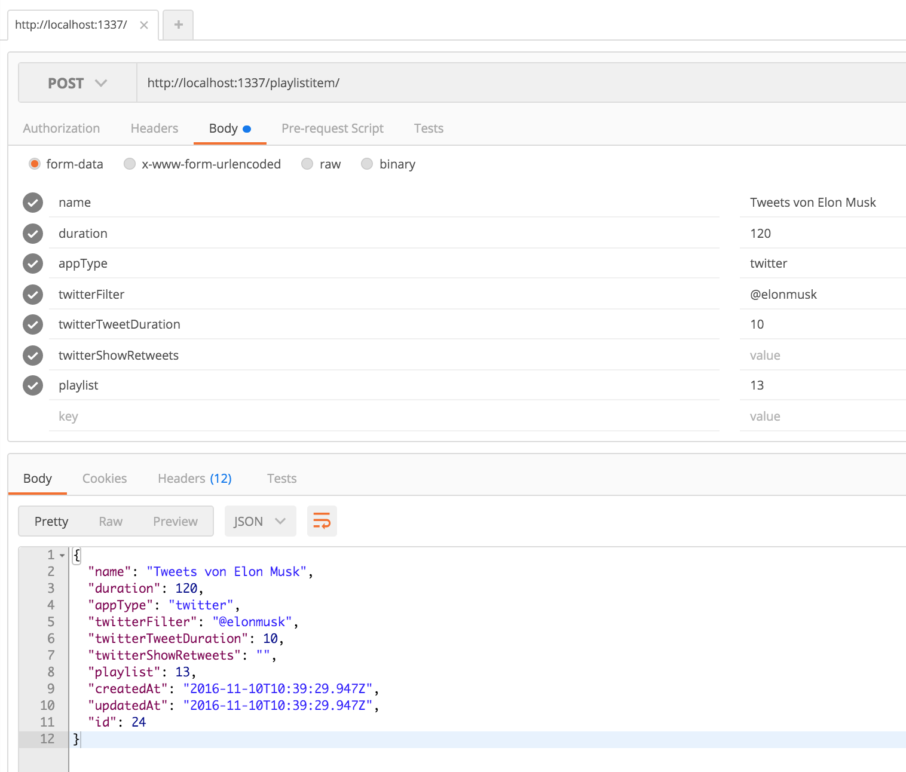
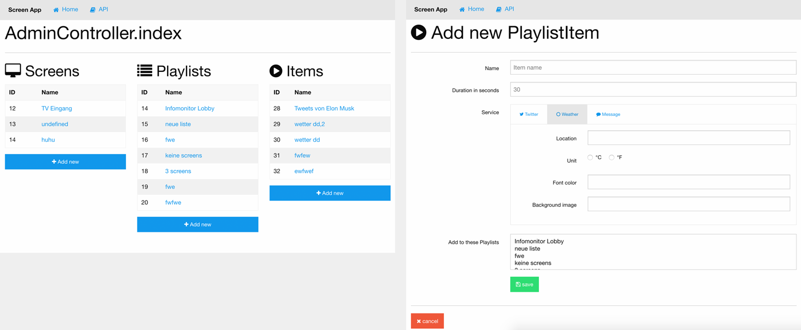

# Screenapp


SCC 2016 Project by [Maik Schneider](@maikschneider) and [Christoph Biering](@chryb).

## Overview

* [Software Stack](#software-stack)
* [Install](#install)
* [Model](#model)
* [Services](#services)
  * [ApiService](#apiservice)
  * [BroadcastService](#broadcastservice)
  * [BaseAppService](#baseappservice)
    * [WeatherService](#weatherservice)
    * [TwitterService](#twitterservice)
    * [DvbService](#dvbservice)
    * [MsgService](#msgservice)
  * [GeocodeService](#geocodeservice)
* [API](#api)
* [Usage](#usage)
* [Backend](#backend)
* Webclients (Anzeige)

## Software Stack

* [sails.js](http://sailsjs.org)
    * ORM [Waterline](https://github.com/balderdashy/waterline-docs)
* [swagger.io](http://swagger.io/)
* [bower](https://bower.io/)
    * [Foundation 6](http://foundation.zurb.com/)

## Install

* run `npm install` inside app directory
* to start the server, run `sails lift`
* navigate into the **assets** directory and run `bower install`

## Model



## Services

Services are defined in `app/api/services`. They can be called from everywhere inside the node application.



### ApiService

Service wrapper for all concrete api services: Passes update requests to particular service based on **PlaylistItem** or **Playlistitem.id + Playlistitem.appType**


### BroadcastService (beta)

The perpose of this service is to controll the play state of all connected screens via socket. It should loop through the Playlists and synchronise the screens by firing up socket events.

### BaseAppService

Abstract service workflow for loading PlaylistItems, receiving API data  and saving data to database. Offers **beforeUpdate** and **afterUpdate** hook to child classes.

#### WeatherService

Gets weather forecast from [openweathermap.org](http://openweathermap.org/). Caches the received data inside the PlaylistItem. Fires a socket event after updating a PlaylistItem.

#### TwitterService

Uses the [Twitter search API](https://dev.twitter.com/rest/public/search) to receive tweets. Implementation of [application-only](https://dev.twitter.com/oauth/application-only) oAuth2 authentification.

#### DvbService

Receives bus- and tramstop data from Dresdens public transportation system. Uses [dvbjs](https://github.com/kiliankoe/dvbjs).

#### MsgService

### GeocodeService

Requests a list of places by a name. Example response for **halle saale**:
```JSON
{ 
  "latitude": 51.4825041,
  "longitude": 11.9705452,
  "country": "Deutschland",
  "city": "Halle (Saale)",
  "state": "Sachsen-Anhalt",
  "zipcode": undefined,
  "streetName": undefined,
  "streetNumber": undefined,
  "countryCode": "DE",
  "provider": "openstreetmap" 
}
```    

## API

After `sails lift`, navigate to [http://localhost:1337/docs/](http://localhost:1337/docs/) to see the swagger-ui doc.



## Usage

There are default methods for creating, updating, deleting,.. objects, see [Sails Bluepring API](http://sailsjs.org/documentation/reference/blueprint-api).

### Example 1: Create Playlistitem:



Screenshot from [Postman](https://www.getpostman.com/)

## Example 2: Read Playlist width attached Screen & Playlistitem objects

Request: `GET http://localhost:1337/playlist/`

Response:
```JSON
[
  {
    "screens": [
      {
        "name": "TV Lobby",
        "list": 12,
        "createdAt": "2016-11-10T10:23:14.791Z",
        "updatedAt": "2016-11-10T10:23:14.791Z",
        "id": 9
      },
      {
        "name": "iPad Kasse",
        "list": 12,
        "createdAt": "2016-11-10T10:24:14.203Z",
        "updatedAt": "2016-11-10T10:24:14.203Z",
        "id": 10
      }
    ],
    "items": [
      {
        "name": "twitterfeed about trump",
        "appType": "twitter",
        "twitterFilter": "#TRUMP",
        "twitterTweetDuration": 10,
        "twitterShowRetweets": true,
        "duration": 30,
        "createdAt": "2016-11-10T10:11:23.716Z",
        "updatedAt": "2016-11-10T10:15:07.872Z",
        "id": 21,
        "playlist": 12
      },
      {
        "name": "öffnungszeiten",
        "appType": "msg",
        "msgHeadline": "Unsere Öffnungszeiten",
        "msgText": "Mo-Fr 9-16 Uhr",
        "msgImage": "hello.jpg",
        "duration": 30,
        "createdAt": "2016-11-10T10:13:10.713Z",
        "updatedAt": "2016-11-10T10:15:30.684Z",
        "id": 22,
        "playlist": 12
      }
    ],
    "name": "Wochentags",
    "createdAt": "2016-11-10T10:06:11.279Z",
    "updatedAt": "2016-11-10T10:19:41.331Z",
    "id": 12
  },
  {
    "screens": [
      {
        "name": "TV Eingang",
        "list": 13,
        "createdAt": "2016-11-10T10:21:24.044Z",
        "updatedAt": "2016-11-10T10:24:27.399Z",
        "id": 8
      }
    ],
    "items": [
      {
        "name": "wetter",
        "appType": "weather",
        "weatherLocation": "Dresden, GER",
        "weatherFontColor": "#000,",
        "weatherBackgroundImage": "darkSky.jpg",
        "duration": 30,
        "createdAt": "2016-11-10T10:18:16.942Z",
        "updatedAt": "2016-11-10T10:20:25.818Z",
        "id": 23,
        "playlist": 13
      }
    ],
    "name": "Abendanzeige",
    "createdAt": "2016-11-10T10:18:43.931Z",
    "updatedAt": "2016-11-10T10:19:56.403Z",
    "id": 13
  }
]
```

## Backend



## Webclients (Anzeige)

* [reveal.js](http://lab.hakim.se/reveal-js/#/)
* iOS App 

