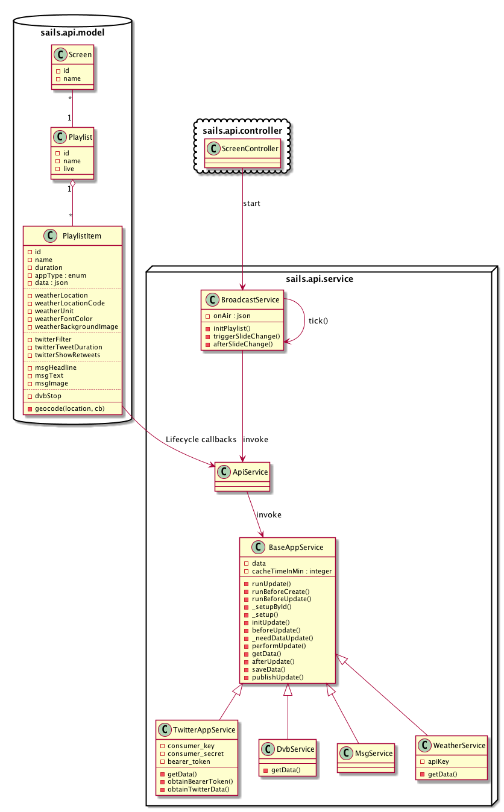

# Screenapp

SCC 2016 Project

## Overview

* Software Stack
* Install
* Model
* API
* Usage
* Webclients (Anzeige)

## Software Stack

* [sails.js](http://sailsjs.org)
    * ORM [Waterline](https://github.com/balderdashy/waterline-docs)
    * Adapters (MySQL, [NeDB](https://github.com/louischatriot/nedb)?)
* [swagger.io](http://swagger.io/)
* [reveal.js](http://lab.hakim.se/reveal-js/#/)

## Install

* run `npm install` inside app directory
* to start the server, run `sails lift`

## Model



## API

After `sails lift`, navigate to [http://localhost:1337/docs/](http://localhost:1337/docs/) to see the swagger-ui doc.


## Usage

There are default methods for creating, updating, deleting,.. objects, see [Sails Bluepring API](http://sailsjs.org/documentation/reference/blueprint-api).

### Example 1: Create Playlistitem:


Screenshot from [Postman](https://www.getpostman.com/)

## Example 2: Read Playlist width attached Screen & Playlistitem objects

Request: `GET http://localhost:1337/playlist/`

Response:
```JSON
[
  {
    "screens": [
      {
        "name": "TV Lobby",
        "list": 12,
        "createdAt": "2016-11-10T10:23:14.791Z",
        "updatedAt": "2016-11-10T10:23:14.791Z",
        "id": 9
      },
      {
        "name": "iPad Kasse",
        "list": 12,
        "createdAt": "2016-11-10T10:24:14.203Z",
        "updatedAt": "2016-11-10T10:24:14.203Z",
        "id": 10
      }
    ],
    "items": [
      {
        "name": "twitterfeed about trump",
        "appType": "twitter",
        "twitterFilter": "#TRUMP",
        "twitterTweetDuration": 10,
        "twitterShowRetweets": true,
        "duration": 30,
        "createdAt": "2016-11-10T10:11:23.716Z",
        "updatedAt": "2016-11-10T10:15:07.872Z",
        "id": 21,
        "playlist": 12
      },
      {
        "name": "öffnungszeiten",
        "appType": "msg",
        "msgHeadline": "Unsere Öffnungszeiten",
        "msgText": "Mo-Fr 9-16 Uhr",
        "msgImage": "hello.jpg",
        "duration": 30,
        "createdAt": "2016-11-10T10:13:10.713Z",
        "updatedAt": "2016-11-10T10:15:30.684Z",
        "id": 22,
        "playlist": 12
      }
    ],
    "name": "Wochentags",
    "createdAt": "2016-11-10T10:06:11.279Z",
    "updatedAt": "2016-11-10T10:19:41.331Z",
    "id": 12
  },
  {
    "screens": [
      {
        "name": "TV Eingang",
        "list": 13,
        "createdAt": "2016-11-10T10:21:24.044Z",
        "updatedAt": "2016-11-10T10:24:27.399Z",
        "id": 8
      }
    ],
    "items": [
      {
        "name": "wetter",
        "appType": "weather",
        "weatherLocation": "Dresden, GER",
        "weatherFontColor": "#000,",
        "weatherBackgroundImage": "darkSky.jpg",
        "duration": 30,
        "createdAt": "2016-11-10T10:18:16.942Z",
        "updatedAt": "2016-11-10T10:20:25.818Z",
        "id": 23,
        "playlist": 13
      }
    ],
    "name": "Abendanzeige",
    "createdAt": "2016-11-10T10:18:43.931Z",
    "updatedAt": "2016-11-10T10:19:56.403Z",
    "id": 13
  }
]
```

## Webclients (Anzeige)

* [reveal.js](http://lab.hakim.se/reveal-js/#/)
* iOS App 

